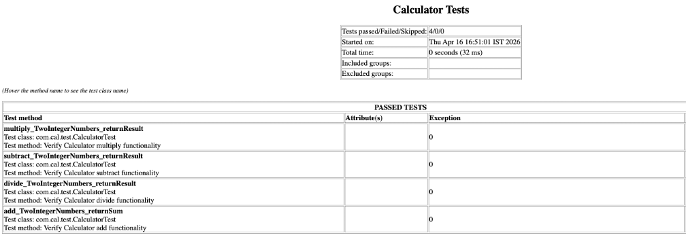

# Calculator - TestNG Maven Project

This project demonstrates a Java-based Calculator application with automated test cases using TestNG and Maven. It showcases how to structure a Maven project, execute tests, and generate reports using the Maven Surefire Plugin.

## Tech Stack
- Java
- Maven
- TestNG
- Maven Plugins: Surefire, Failsafe, JaCoCo
- Git & GitHub

## Features
- Basic calculator operations (Add, Subtract, Multiply, Divide)
- Automated test execution using TestNG
- Maven-based project structure
- Test execution using Maven lifecycle
- Unit test execution and HTML reports via Maven Surefire Plugin
- Integration test execution via Maven Failsafe Plugin
- Code coverage reports via JaCoCo Plugin

## Test Reports
Test execution reports are generated using the Maven Surefire Plugin.

Path:target/surefire-reports/
Includes:
- HTML report
- XML results
- Execution summary

## How to Run ?
mvn clean test

This command:
- Removes old build files to ensure a fresh start
- Compiles the project
- Runs all TestNG test cases
- Generates test reports using Maven Surefire Plugin

## Through this project, I gained understanding of:

- Importance of standard Maven project structure for scalability and maintainability
- Maven lifecycle phases (validate → compile → test → package → install → deploy)
- Role of pom.xml as the central configuration file managing dependencies and build lifecycle
- Integration of TestNG with Maven for automated test execution
- How Maven Surefire Plugin executes TestNG tests and generates reports
- Version control using Git and pushing code to GitHub using terminal commands

## Test Automation Best Practices Followed

- **Descriptive Test Naming**
  Test methods follow a clear naming convention:
- 
  methodName_condition_expectedResult  
  Example: add_TwoIntegers_returnSum

- **No Loops in Test Cases**
- 
  Each test validates a single scenario to keep tests simple and readable.

- **No Exception Handling in Tests**
- 
  Exceptions are allowed to fail the test naturally, ensuring issues are not hidden.

- **Avoid Code Duplication**
- 
  Common objects are declared as instance variables instead of creating them in every test method.

- **No Input/Output Operations**
- 
  Tests are kept independent of external inputs like files or user input to ensure reliability.

- **Use Mocking for External Dependencies**
- 
  External systems (e.g., database, APIs) should be mocked to keep tests fast and isolated.

## Test Execution Result

This report shows the successful execution of TestNG test cases with all tests passing.

